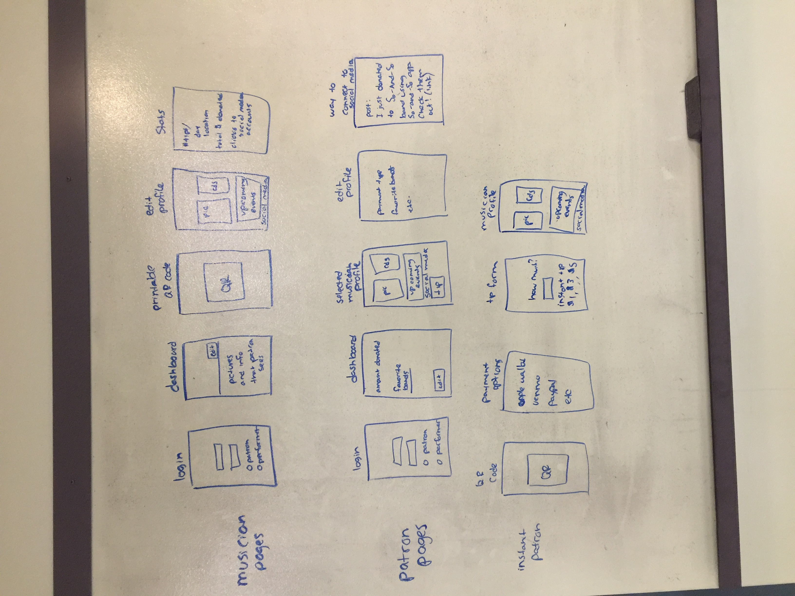
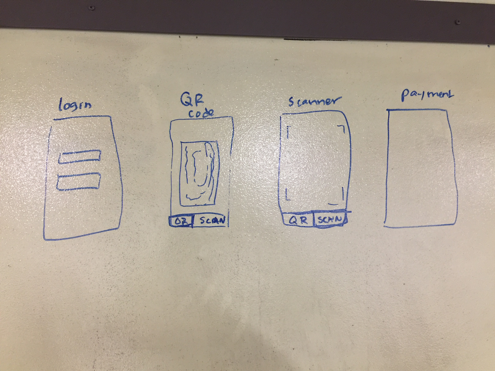
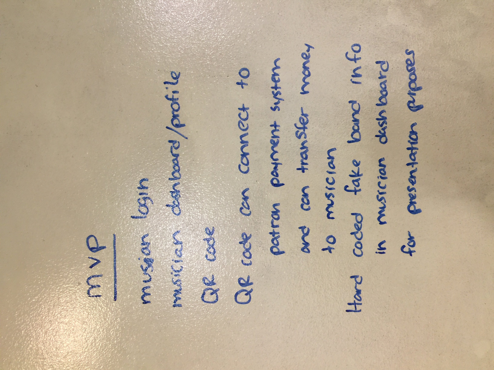

# Project Name - Tipsy Hat

## Authors: Jeremy Lee, Elizabeth Kavalski, Adrienne Easton, Joseph Hangarter

### Overview

To make an app that can be used to tip street performers, in a world that carries little cash. Creating functionality for both patrons who want to tip quickly and easily, as well as patrons who want to create more ongoing connection with favorite performers. 

### Links and Resources
* [Github Repository](https://github.com/401-javaScript-final-project/final-project-frontend/tree/master)

### Modules
#### `App.js`
#### `screens folder`
  * #### `auth folder`
    * #### `signupScreen.js`
    * #### `loginScreen.js`
#### `app folder`
  * #### `homeScreen.js`
  * #### `qrScreen.js`
  * #### `paymentScreen.js`
  * #### `paypalScreen.js`
  * #### `scannerScreen.js`
  * #### `fixtimerbug.js` - temporary fix for android timer bug issue with react native + firebase
#### `navigation folder`
  * #### `mainNavigator.js`
#### `styles folder`
  * #### `styles.js`

### Setup

#### Running the app
* `npm start`
* Site will open in browser with QR code.
* Scan QR code with phone using camera.
* Follow prompt in camera to expo app (must have expo app installed on phone).
  
#### Tests
* Usability tests
* Used mock of Firebase

#### UML

